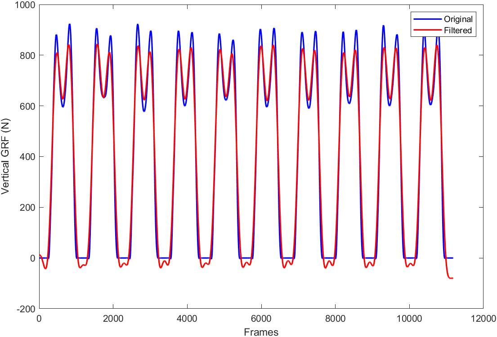
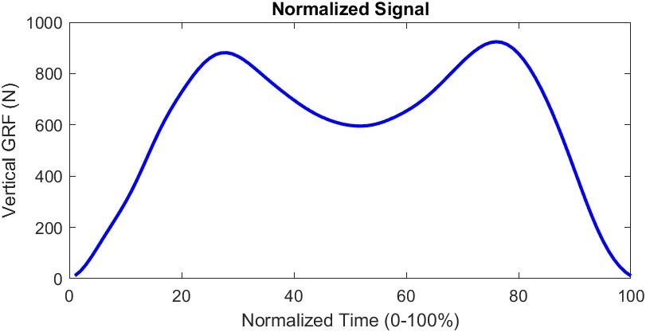
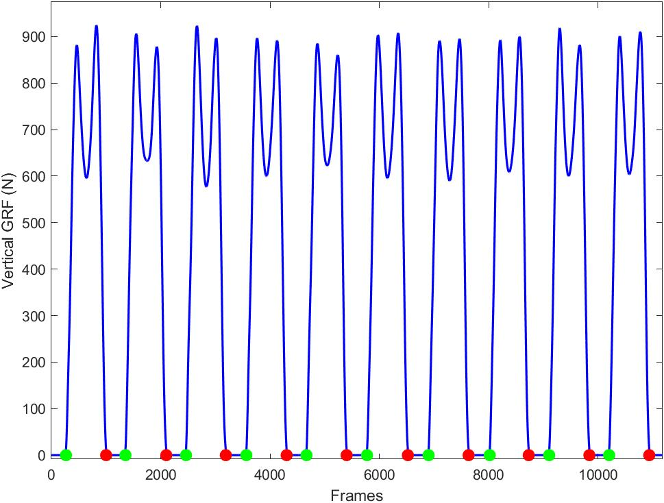

# Biomechanical Gait Analysis in MATLAB

This repository hosts scripts related to human biomechanical gait analysis.

---

## Signal Processing

### Applying Butterworth Filters
`butterworth_filter.m`: This script provides a template for applying a 4th-order lowpass Butterworth filter with a cutoff frequency of 6 Hz. The script includes calls to `butter()` and `filtfilt()` to filter a vertical ground reaction force signal. The script also plots the original and filtered signals.  

### Normalizing a time-series signal from 0-100%
`time_normalize.m`: This script provides a template for normalizing a time-series signal from 0-100% (e.g., from 0-100% of the support phase). The script includes calls to the built-in function `spline()` and `gait_events_grf()` to normalize a vertical ground reaction force signal for a single step during walking. The script also plots the original and normalized signals.  

---

## Gait Event Detection

### Identifying Heel Strikes and Toe Offs
`gait_events_grf.m`: This function uses a 10N threshold on the vertical GRF to identify heel strikes and toe offs.  

`impliment_example.m`: This script provides an example template for implimenting `gait_events_grf.m`. The script loads the example data file grf_gait_events_data.mat, uses the function to identify heel strikes and toe offs, and plots the GRF signal with event frames highlighted.

---

## Joint-level Kinetics

### Hip Joint
`hip_moment_vars.mat`: This function calculates support phase hip joint extensor and flexor peak moments and angular impulses. 

`hip_power_vars.mat`: This function calculates support phase hip jont extensor peak positive power and positive work (early support phase), hip flexor peak negative power and negative work (mid-support phase), hip flexor peak positive power and positive work (late support phase), and total joint positive and negative work. 

### Knee Joint
`knee_moment_vars.mat`: This function calculates support phase knee joint extensor and flexor peak moments and angular impulses.

`knee_power_vars.mat`: This function calculates support phase knee joint extensor peak positive power and positive work, and total joint positive and negative work. 

### Ankle Joint
`ankle_moment_vars.mat`: This function calculates support phase ankle joint extensor (plantarflexor) and flexor (dorsiflexor) peak moments and angular impulses.

`ankle_power_vars.mat`: This function calculates support phase ankle joint peak positive power and positive and negative work.

---

## Ground Reaction Forces
`grf_vars`: This function returns the first and second peaks and the total impulse of the vertical ground reaction force of a single step. It also returns posterior and anterior peaks and impulses of the anteroposterior ground reaction force of a single step.
